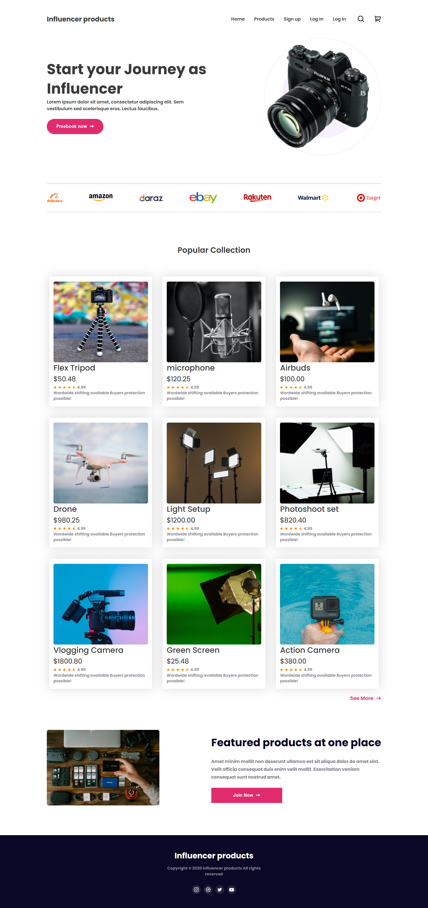

# 📸 Influencer Gear - Premium E-commerce Landing Page

A sleek, modern, and **fully responsive** e-commerce landing page designed specifically for content creators and influencers. This project showcases a catalog of high-quality gear including cameras, microphones, and lighting setups.

---


## ✨ Key Features

- **Fully Responsive Design:** Optimized for all screen sizes—from large desktop monitors to tablets and mobile devices.
- **Modern UI/UX:** Clean aesthetic with a focus on high-quality imagery and clear typography.
- **Interactive Product Grid:** 9 distinct product cards featuring hover effects, star ratings, and price tags.
- **Trust Signals:** A dedicated section for partner brand logos (Amazon, eBay, Walmart, etc.).
- **Call to Action (CTA):** Strategically placed "Prebook now" and "Join Now" buttons to drive conversions.

---

## 🛠️ Technical Stack

- **HTML5:** Semantic markup for better SEO and accessibility.
- **CSS3:** Utilizing **Flexbox** and **CSS Grid** for complex layouts and perfect responsiveness.
- **Media Queries:** Custom breakpoints to ensure the layout shifts seamlessly on mobile devices.
- **Google Fonts:** Integration of premium sans-serif typography.
- **FontAwesome:** For social media and UI icons.

---

## 📱 Responsiveness Breakdown

| Device      | Behavior                                                                                  |
| :---------- | :---------------------------------------------------------------------------------------- |
| **Desktop** | Full 3-column product grid with side-by-side Hero content.                                |
| **Tablet**  | 2-column product grid to maintain readability and touch targets.                          |
| **Mobile**  | Single-column layout with stacked navigation and centered text for easy thumb navigation. |

---
## 🚀 Live Demo

Live Link https://themdshakibul.github.io/influencer-gear-website/

## 📂 Project Structure

```text
├── index.html          
├── style.css           
├── images/             
└── README.md           
```

## 📸 Project Preview



---
